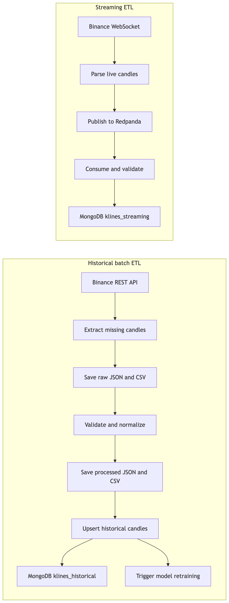

# Agenda

- Market context and problem statement
- Project objectives and architecture
- Data engineering pipelines:
  batch ETL and streaming ingestion
- Data modeling, machine learning, and model choice
- APIs, dashboards, automation, results, limitations, and roadmap
- Demo and Q/A
---

# Market Context

- Cryptocurrency markets operate 24/7 and generate high-frequency price movements
- BTC/USDT is highly liquid, volatile, and well documented through public APIs
- Manual monitoring is too slow for continuous market observation
- Automation is therefore required for collection, processing, prediction, and visualization

Key message:
- Market speed and volatility make an automated pipeline necessary

---

# Problem Statement

- Raw exchange data is not directly ready for analytics or ML
- Historical and live data must be collected in different ways
- The system must avoid missing data, duplicates, and unstable manual workflows
- Predictions must be exposed in a form that users can consume quickly

Research question:
- How can we design an end-to-end system to collect, store, model, and expose crypto trading signals in near real time?

---

# Project Objectives

- Collect Binance data both historically and in real time
- Structure the data into reliable storage layers
- Train a classification model to predict next-candle direction
- Expose predictions through a REST API
- Visualize both model outputs and market behavior through dashboards
- Containerize and automate the entire pipeline

Key message:
- The project combines data engineering, ML, and production-style delivery

---

# Solution Architecture

- The platform is organized into five logical layers:
  sources, ETL, storage, ML/API serving, and visualization
- Historical batch path is the current backbone of the ML workflow
- Streaming path supports fresh market visibility and operational monitoring
- All services run inside a shared Docker Compose network

Visual:
- 

---

# Why This Tech Stack

- MongoDB:
  flexible schema, fast latest-candle queries, strong fit for document-shaped market data
- Redpanda:
  Kafka-compatible streaming broker with simpler local operations
- FastAPI:
  async APIs, strong schema validation, built-in docs
- Streamlit:
  fast Python-based business dashboard
- Grafana:
  monitoring and time-series visualization
- Docker Compose:
  one-command reproducible deployment

Key message:
- Every technology was chosen for operational simplicity and fast iteration

---
# Historical Batch Pipeline

- Implemented by `binance-collector`
- Runs once at container startup, then every hour via cron
- Focused on complete and gap-free historical data
- Produces both file outputs and MongoDB updates
- Triggers model retraining when new historical data is inserted

Current implementation note:
- This repo uses a cron-based collector, not Airflow

Visual:
- 

---

# ETL: Extract

- Source:
  Binance REST API `/api/v3/klines`
- The collector checks what raw data already exists on disk
- It computes missing time ranges instead of doing a full refresh
- It fetches only the missing candles with pagination, retries, and rate-limit handling
- Raw outputs are saved as JSON and CSV in `data/raw_data`

Key message:
- Extraction is incremental and recovery-friendly

---

# ETL: Transform

- Raw Binance arrays are converted into validated `HistoricalKline` objects
- The transform stage enforces:
  symbol normalization, interval validation, timestamp checks, OHLC consistency, and non-negative volumes
- Clean rows are written to `data/processed_data` as JSON and CSV
- The output is now analytics-ready and consistent across the rest of the system

Key message:
- This is where raw market payloads become structured pipeline data

---

# ETL: Load

- Validated historical rows are upserted into MongoDB collection `klines_historical`
- Idempotency key:
  `symbol + interval + open_time_ms`
- A unique Mongo index prevents duplicates and supports safe reruns
- If MongoDB is empty, the collector can rebuild it from processed files already stored on disk

Key message:
- The load stage is reliable, repeatable, and built for restart safety

---

# Real-Time Streaming Pipeline

- Source:
  Binance WebSocket candle stream
- `stream-producer` reads live candles and publishes messages to Redpanda
- `stream-consumer` reads from Redpanda and persists documents into `klines_streaming`
- If the database is temporarily unavailable, Redpanda keeps the messages buffered

Current implementation note:
- Streaming is mainly used for freshness, monitoring, and merged dashboard views

---

# Data Modeling and Storage

- Main database:
  MongoDB
- Two collections serve different needs:
  `klines_historical` for training and historical inference
  `klines_streaming` for recent live data
- Historical values are stored with high precision and indexed for fast retrieval
- File storage is kept in parallel for traceability and recovery

Reported dataset snapshot:
- 143,996 stored five-minute candles
- Coverage from January 1, 2024 to March 21, 2026

---

# ML Objective and Dataset

- Prediction target:
  next 5-minute candle direction, UP or DOWN
- This is framed as a binary classification problem
- Direction prediction is more robust than exact price prediction
- The dataset is chronologically split:
  80% train, 20% test
- The model is trained on historical data only to avoid leakage

Key message:
- Time order matters more than random shuffling in financial ML

---

# Feature Engineering

- The model does not train directly on raw OHLCV values
- Key engineered features include:
  `log_return`, `volatility`, `ma_10`, `ma_30`, `momentum`, `buy_ratio`, `spread`, `trade_count`
- These features capture trend, speed, volatility, activity, and buy pressure
- Standardization is applied after the chronological split

Key message:
- Model quality depends heavily on the transformation of raw candles into useful signals

---

# Model Results

- Retained model:
  Logistic Regression
- Test accuracy:
  74.34%
- AUC:
  0.8173
- The UP and DOWN classes are balanced, with symmetrical precision and recall around 0.74
- Train score and test score remain close, which suggests limited overfitting

Key message:
- The model is simple, but the results are strong for noisy financial time series

---

# Why Logistic Regression Was Selected

- Logistic Regression and SVM delivered very similar predictive performance
- Logistic Regression was retained because it is:
  faster to train, easier to interpret, and cheaper to serve
- This matters because the project retrains automatically every hour
- SVM was not operationally suitable for frequent retraining or low-latency inference

Comparison from the report:
- Logistic Regression:
  74.34% accuracy, AUC 0.8173
- SVM:
  74.18% accuracy, AUC 0.82

---

# API and User Interfaces

- `prediction-api` exposes prediction, model status, and retrain endpoints
- `main` exposes Grafana-compatible query routes and health endpoints
- Streamlit is the business-facing dashboard for ML signals
- Grafana is the monitoring dashboard for market views and time-series exploration
- Mongo Express and Redpanda Console help with developer operations and inspection

Key message:
- The platform serves both end users and technical operators

---

# Containerization and Automation

- The system runs as 12 Docker services on a shared internal network
- Automation flow:
  hourly collection -> Mongo upsert -> retrain request -> model reload -> dashboard refresh
- `collector-entrypoint.sh` runs one immediate sync and then keeps cron alive
- `docker-up-clean.sh` handles startup sequencing, health checks, and first model bootstrapping

Operational result:
- A reproducible environment with one-command startup

---

# Results, Limitations, and Roadmap

- Reported pipeline outcomes:
  232,282 observations collected, hourly retraining, API inference under 500 ms for 50 candles
- Strengths:
  end-to-end automation, clear architecture, reliable ETL, reproducible deployment
- Current limitations:
  linear model ceiling, no backtesting, no trading fees, no sentiment or news inputs
- Next steps:
  stronger models, richer indicators, cloud deployment, ML monitoring, and advanced orchestration

Closing message:
- The project already demonstrates a credible production-style data and ML platform, with a clear path toward a more advanced trading system
